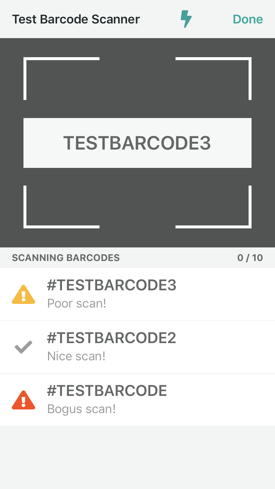

# SplitScreenScanner

[](https://travis-ci.org/10d656fb252a6769bbb7c085a1a2012bc5a98ebe/SplitScreenScanner)
[](http://cocoapods.org/pods/SplitScreenScanner)
[](http://cocoapods.org/pods/SplitScreenScanner)
[](http://cocoapods.org/pods/SplitScreenScanner)

## Example

SplitScreenScanner lets you quickly and easily add a fully functioning barcode scanner, with scan history, to any part of your app. Here's a simple example of how it looks:

```swift
class StartScanningViewController: UIViewController {
    let startingBarcode = "SO0000000001195"

    var splitScannerCoordinator: SplitScannerCoordinator?

    @IBAction func startScanningButtonPressed(_ sender: Any) {
        do {
            guard let navigation = navigationController else { return }

            let scannerTitle = "Split Screen Scanner" // Used as the main navigation title for the scanner

            // The scanHistoryDataSource parameter is used to populate the scan history TableView with some needed text values (e.g. the TableView's header)
            // The scanToContinueDataSource parameter is used to provide the scan to begin and scan to continue views with necessary functionality and text values (e.g. function for scanning the starting barcode, title for scan to begin view, etc...)
            let splitScannerCoordinator = try SplitScannerCoordinator(scannerTitle: scannerTitle, scanHistoryDataSource: self, scanToContinueDataSource: self)
            splitScannerCoordinator.delegate = self

            let scannerViewController = try splitScannerCoordinator.makeRootViewController()
            navigation.present(scannerViewController, animated: true)
        } catch {
            print(error)
        }
    }
}

// MARK: - SplitScannerCoordinatorDelegate
extension StartScanningViewController: SplitScannerCoordinatorDelegate {

    // Called just after every scan during an unexpired scan session.
    // The ScanResult that is returned by this function is used by the scanner to populate the values of the scan history cells
    // The description on the scan result is used to populate the descrition on the cell, but the value of the ScanResult itself is used to determine which image is used on the cell:
    // .success -> green checkmark image
    // .warning -> yellow exclamation triangle
    // .error -> red exclamation triangle
    // The "blocking" value that is returned by this function decides if this scan should block the scanner.
    // When the scanner is blocked, a grey background and smaller white overlay with the last scanned barcode's value inside will be displayed in place of the scanner.
    // To unblock the scanner, call splitScannerCoordinator.unblockScanner()
    func didScanBarcode(_ splitScannerCoordinator: SplitScannerCoordinator, barcode: String) -> (result: ScanResult, blocking: Bool) {
        print("Scanned: " + barcode)
        switch Int(arc4random_uniform(4)) {
        case 0...1:
            return (result: .success(description: "Nice scan!"), blocking: false)
        case 2:
            return (result: .warning(description: "Poor scan!"), blocking: false)
        default:
            return (result: .error(description: "Bogus scan!"), blocking: false)
        }
    }

    // Called when the done button is pressed. Dismiss the scanner as appropriate.
    func didPressDoneButton(_ splitScannerCoordinator: SplitScannerCoordinator) {
        print("Closing SplitScreenScanner")
        dismiss(animated: true)
    }
}

// MARK: - ScanHistoryDataSource
extension StartScanningViewController: scanHistoryDataSource {

    // Header for the scan history table view
    var tableViewHeader: String {
        return "Scanning Items to Truck"
    }

    // Text displayed when no scans have been made during the current scanning session
    var nothingScannedText: String {
        return "Scan an item to start loading"
    }
    
    // Used for playing sounds just after a barcode scan is made
    func playBarcodeScanSound(for result: ScanResult) {
        // Play scanning sound
    }
}

// MARK: - ScanToContinueDataSource
extension StartScanningViewController: ScanToContinueDataSource {

    // Used for the title of the scan to begin view (starting a scanning session for the first time)
    var startingTitle: String {
        return "Scan Barcode #\(startingBarcode) to Begin"
    }

    // Used for the description of the scan to begin view
    var startingDescription: String? {
        return "Please scan my barcode"
    }

    // Used for the title of the scan to continue view (starting a scanning session after the first one has expired)
    var continuingTitle: String {
        return "Continue?"
    }

    // Used for the description of the scan to continue view
    var continuingDescription: String? {
        return "Scan barcode #\(startingBarcode)"
    }

    // Used to start and unexpire scanning session (A scanning session will not start until this function returns .success)
    func scan(startingBarcode: String) -> ScanResult {
        if startingBarcode == self.startingBarcode {
            return .success(description: nil)
        } else {
            return .error(description: "Wrong Barcode Scanned")
        }
    }
    
    // Used for playing sounds just after a starting or continuing scan is made
    func playScanToContinueSound(for result: ScanResult) {
        // Play scanning sound
    }
    
    // Called just after the scanning session expires
    func didExpireScanningSession() {
        print("Scanning session expired")
    }
}
```

Please note that when initializing splitScannerCoordinator the `scanToContinueDataSource: ScanToContinueDataSource?` parameter is optional. Only populate this parameter with a value if you want your scanning session to require an initial scan, using the `scan(startingBarcode:)` method, to start the main barcode scanner (e.g. need to scan truck before scanning items) and if you want your scanning session to be expirable. Being expirable means that your scanning session will expire after 30 seconds without a scan, or when the app is backgrounded. If a scanning session expires then it will need to be started again. This means the scanner will now be calling the `scan(startingBarcode:)` method again until it receives a .success ScanResult.


(Scan to begin view)

If you want your users to jump straight into an unexpirable scanning session, then simply just use nil for the `scanToContinueDataSource` parameter:

```swift
splitScannerCoordinator = try SplitScannerCoordinator(navigation: navigation, scannerTitle: scannerTitle, scanHistoryDataSource: self, scanToContinueDataSource: nil)
```


(Empty scan history view)

If a scan has blocking set to true, then the scanner will be blocked and remain blocked until `splitScannerCoordinator.unblockScanner()` is called.


(Blocked scanner view)

## Requirements

- iOS 11.0+
- Swift 4.1+

## Installation

SplitScreenScanner is available through [CocoaPods](http://cocoapods.org). To install
it, simply add the following line to your Podfile:

```ruby
pod 'SplitScreenScanner', git: 'https://github.com/clutter/SplitScreenScanner'
```

## Author

Sean Machen, sean.machen@clutter.com

## License

SplitScreenScanner is available under the MIT license. See the LICENSE file for more info.
