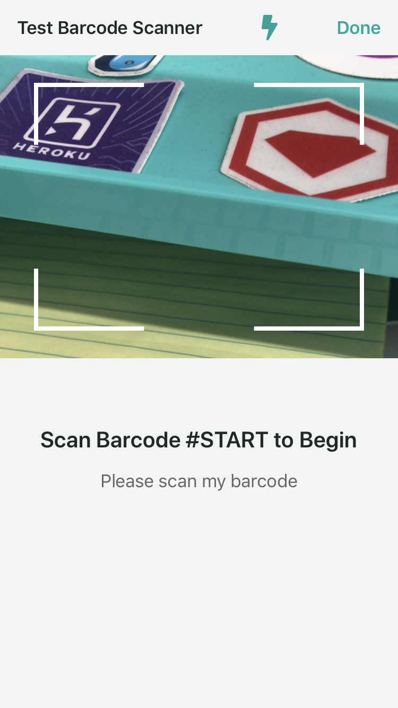

# SplitScreenScanner

[](https://circleci.com/gh/clutter/SplitScreenScanner)
[](https://github.com/clutter/SplitScreenScanner/releases)

## Example

SplitScreenScanner lets you quickly and easily add a fully functioning barcode scanner, with scan history, to any part of your app. Here's a simple example of how it looks:

```swift
class StartScanningViewController: UIViewController {
    let startingBarcode = "START"

    var splitScannerCoordinator: SplitScannerCoordinator?

    @IBAction func startScanningButtonPressed(_ sender: Any) {
        do {
            guard let navigation = navigationController else { return }

            let scannerTitle = "Split Screen Scanner" // Used as the main navigation title for the scanner

            // The scanHistoryDataSource parameter is used to populate the scan history TableView with some needed text values (e.g. the TableView's header)
            // The scanToContinueDataSource parameter is used to provide the scan to begin and scan to continue views with necessary functionality and text values (e.g. function for scanning the starting barcode, title for scan to begin view, etc...)
            let splitScannerCoordinator = try SplitScannerCoordinator(scannerTitle: scannerTitle, scannerDismissTitle: scannerDismissTitle, scanHistoryDataSource: self, scanToContinueDataSource: self)
            splitScannerCoordinator.delegate = self

            let scannerViewController = try splitScannerCoordinator.makeRootViewController()
            navigation.present(scannerViewController, animated: true)
        } catch {
            print(error)
        }
    }

    // A `SplitScannerCoordinatorDelegate` can return a `pending` result from its `didScanBarcode` method. This is useful when an asynchronous task needs to be performed to determine if the scan was successful. Pending scans will not be displayed in the scan history.
    //
    // While the task is ongoing, it is recommended to block the scanner with `blockScanner`. When the task is completed, unblock the scanner with `unblockScanner` and manually add the appropriate `success`, `warning`, or `error` result to the scan history by calling `addScanResult`.
    func addScanResult(_ scanResult: ScanResult, barcode: String) {
        splitScannerCoordinator.addScanResult(scanResult, barcode: barcode)
    }
}

// MARK: - SplitScannerCoordinatorDelegate
extension StartScanningViewController: SplitScannerCoordinatorDelegate {

    // Called just after every scan during an unexpired scan session.
    // The ScanResult that is returned by this function is used by the scanner to populate the values of the scan history cells
    // The description on the scan result is used to populate the descrition on the cell, but the value of the ScanResult itself is used to determine which image is used on the cell:
    // .success -> green checkmark image
    // .warning -> yellow exclamation triangle
    // .error -> red exclamation triangle
    func didScanBarcode(_ splitScannerCoordinator: SplitScannerCoordinator, barcode: String) -> ScanResult {
        print("Scanned: " + barcode)
        switch Int(arc4random_uniform(4)) {
        case 0...1:
            return .success(description: "Nice scan!")
        case 2:
            return .warning(description: "Poor scan!")
        default:
            return .error(description: "Bogus scan!")
        }
    }

    // Called when the dismiss button is tapped. Dismiss the scanner as appropriate.
    // This will not be called if the `scannerDismissTitle` used to initialize the `SplitScannerCoordinator` is nil.
    func didTapDismissButton(_ splitScannerCoordinator: SplitScannerCoordinator) {
        print("Closing SplitScreenScanner")
        splitScannerCoordinator.popCoordinators()
        dismiss(animated: true)
    }

    // Optional method that determines whether `didTriggerDismissal(_:with:)` should be called after a scan.
    // By default, this method always returns false.
    func shouldDismiss(after scanResult: ScanResult) -> Bool {
        switch scanResult {
        case .success:
            return true
        case .error, .warning:
            return false
        }
    }

    // Optional method that is called after a scan if `shouldDismiss(after:)` returns `true`.
    func didTriggerDismissal(_ splitScannerCoordinator: SplitScannerCoordinator, with scanResult: ScanResult) {
        print("Closing SplitScreenScanner after successful scan")
        dismiss(animated: true)
    }
}

// MARK: - ScanHistoryDataSource
extension StartScanningViewController: scanHistoryDataSource {

    // Title for the scan history table view
    var tableViewHeaderTitle: String {
        return "Scanning Barcodes"
    }

    // Subtitle for the scan history table view, displayed on the right side of the header
    // If this is nil, then the subtitle will not be displayed
    var tableViewHeaderSubtitle: String? {
        let uncompletedItemCount = arc4random_uniform(10)
        return "\(uncompletedItemCount) / 10"
    }

    // Text displayed when no scans have been made during the current scanning session
    var nothingScannedText: String {
        return "Start scanning"
    }

    // Used for playing sounds just after a barcode scan is made
    func playBarcodeScanSound(for result: ScanResult) {
        // Play scanning sound
    }
}

// MARK: - ScanToContinueDataSource
extension StartScanningViewController: ScanToContinueDataSource {

    // Used for the title of the scan to begin view (starting a scanning session for the first time)
    var startingTitle: String {
        return "Scan Barcode #\(startingBarcode) to Begin"
    }

    // Used for the description of the scan to begin view
    var startingDescription: String? {
        return "Please scan my barcode"
    }

    // Used for the title of the scan to continue view (starting a scanning session after the first one has expired)
    var continuingTitle: String {
        return "Continue?"
    }

    // Used for the description of the scan to continue view
    var continuingDescription: String? {
        return "Scan barcode #\(startingBarcode)"
    }

    // Used to start and unexpire scanning session (A scanning session will not start until this function returns .success)
    func scan(startingBarcode: String) -> ScanResult {
        if startingBarcode == self.startingBarcode {
            return .success(description: nil)
        } else {
            return .error(description: "Wrong Barcode Scanned")
        }
    }

    // Used for playing sounds just after a starting or continuing scan is made
    func playScanToContinueSound(for result: ScanResult) {
        // Play scanning sound
    }

    // Called just after the scanning session expires
    func didExpireScanningSession() {
        print("Scanning session expired")
    }
}
```

Please note that when initializing splitScannerCoordinator, the `scanToContinueDataSource: ScanToContinueDataSource?` parameter is optional. Only populate this parameter if you want your scanning session to require an initial scan to start the main barcode scanner (which will call `scan(startingBarcode:)`), and if you want your scanning session to be expirable. Being expirable means that your scanning session will expire after a short period of time without a scan, or when the app is backgrounded. If a scanning session expires, it will need to be started again. This means the scanner will call `scan(startingBarcode:)` again until it returns `ScanResult.success`.


(Scan to begin view)

If you want your users to jump straight into an unexpirable scanning session, then simply just use nil for the `scanToContinueDataSource` parameter:

```swift
splitScannerCoordinator = try SplitScannerCoordinator(navigation: navigation, scannerTitle: scannerTitle, scannerDismissTitle: scannerDismissTitle, scanHistoryDataSource: self, scanToContinueDataSource: nil)
```


(Empty scan history view)

To temporarily disable the scanner, call `splitScannerCoordinator.blockScanner(withMessage: barcode)`. While the scanner is disabled, it will display the message passed to `blockScanner(withMessage:)` (in this case, `barcode`) instead of the camera. To re-enable the scanner, call `splitScannerCoordinator.unblockScanner()`.


(Blocked scanner view)

To avoid duplicate scans, the scanner will not scan the same barcode twice in a row. If you want to allow your users to undo the last scan, or want to allow rescanning the last barcode for any other reason, call `splitScannerCoordinator.resetLastScannedBarcode()`.

## Requirements

- iOS 12.2+
- Swift 5.0+

## Installation

SplitScreenScanner is available through Swift Package Manager.

## Author

Sean Machen, sean.machen@clutter.com

## License

SplitScreenScanner is available under the MIT license. See the LICENSE file for more info.
